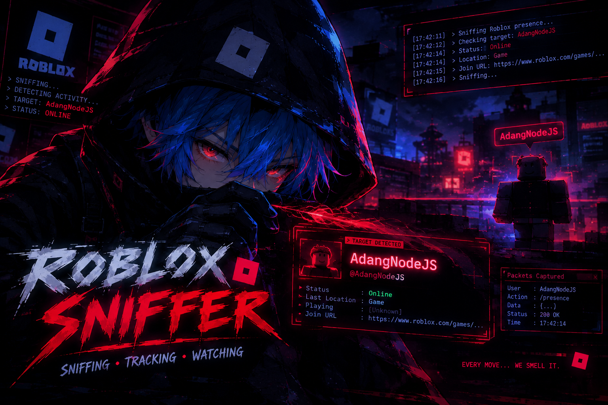

# RobloxSniffer



Deskripsi
-------
RobloxSniffer adalah plugin ringan untuk Brainxiex bot WhatsApp yang menyediakan fitur integrasi atau utilitas terkait Roblox. README ini menjelaskan cara instalasi, penghapusan, dan informasi singkat penggunaan.

Instalasi
-------
Jalankan perintah berikut pada mesin yang menjalankan framework plugin:

```sh
./linux plugin install gh:Barqah-Xiex/brainxiex-bot-whatsapp-plugin/RobloxSniffer
```
atau
```sh
./linux plugin install bx:cdn/gh/botwa-plugin/RobloxSniffer
```

Penghapusan (Uninstall)
-------
Untuk menghapus plugin:

```sh
./linux plugin uninstall gh:Barqah-Xiex/brainxiex-bot-whatsapp-plugin/RobloxSniffer
```
atau
```sh
./linux plugin uninstall bx:cdn/gh/botwa-plugin/RobloxSniffer
```

Penggunaan singkat
-------
- Setelah instalasi, periksa dokumentasi utama bot atau pengaturan plugin untuk mengaktifkan dan mengonfigurasi fitur.
- Jika plugin menyediakan perintah chat, gunakan perintah yang disediakan oleh bot (lihat dokumentasi fitur di folder `fitur/`).

Gambar Preview
-------
Gambaran antarmuka atau contoh output plugin ada pada gambar di atas.

Kontribusi
-------
Perbaikan, laporan bug, dan fitur baru sangat diterima. Buat pull request ke repository utama.

Lisensi
-------
Lihat lisensi pada repository utama atau tanyakan pemilik project untuk detail penggunaan.
